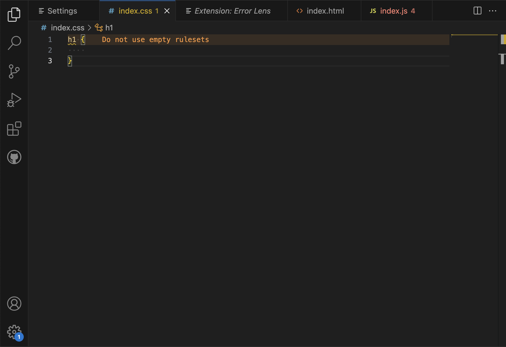

# Enhance Your VSCode Experience with Three Must-Have Extensions

The extension is the attractive part of VSCode to help you write the code effectively, concretely, and see intuitively. It also contains new languages, debuggers, and tools to support your development workflow. Now, I'm going to introduce you to my recommendation to help you when you are working on a project with VSCode.

The **Live Server**, I would like to recommend is a live server extension. Live server is the extension that helps you to see intuitively what is happening with what you wrote with HTML code through the web browser and it changes right away if you make any changes to your HTML code.
[Live Server](https://marketplace.visualstudio.com/items?itemName=ritwickdey.LiveServer)

The next one is an **Error Lens** which allows you to see Error, warning and diagnostic messages that fit the code displayed on the line without clicking it.
[Error Lens](https://marketplace.visualstudio.com/items?itemName=usernamehw.errorlens)

Lastly, the **Prettier Extension** is the extension that makes your code much prettier, so you don't need to worry about clean code while you're working on the logical stuff.
[Prettier](https://marketplace.visualstudio.com/items?itemName=esbenp.prettier-vscode)

# How Can I Get Those Extensions?

If you liked the extensions above, and try to apply it to your workplace, then the next thing you might need to do is _search_ the _extensions_ and download it. The following is an explanation of how to download extensions, and let's download what you want.

1. Go to Extension Veiw. View > Extensions(CTRL+SHIFT+X / ⇧⌘X)
   The First step is open the VSCode and click the extension button on the left-side interface,  
     
   then you will see the extension window pop from the left-side interface like the picture below.
   

2. Search for the extension you want to find.
   The next step is write down the extension name on the search bar.
   

3. Install the **Liver Server** extension.
   You will see many different extension when you search for **Live Server**. Click the same extension as shown in the picture.
   Then, you will able to see the install button on the right-side window.  
   

4. Manage gear button
   When you install the extension, the install button will change to manage gear button which is **Disable and Uninstall** button. Just let you know if you click the **Disable** button, the extension will not be using until you enable the extension again. The **Uninstall** button is for _deleting_ the extension from your local machine.
   

# How can I use it?

## Using Live Server Extension

1. Start by creating an HTML file. Type an exclamation mark (!) and press Tab (Tab ↹) to automatically generate basic HTML code in your file. Then, write "Hello World" under the _&lt;body&gt;_ tag.

   ```html
   <!DOCTYPE html>
   <html lang="en">
   <head>
      <meta charset="UTF-8" />
      <meta name="viewport" content="width=device-width, initial-scale=1.0" />
      <title>Document</title>
   </head>
   <body>
      Hello World!
   </body>
   </html>
   ```

2. Next, click the "Go Live" button at the bottom of the VSCode.

3. Your web browser will open automatically, displaying the "Hello World" content from your HTML file. Any code changes you make will be applied to the browser in real-time. 

## Using Error Lens Extension

1. Before installing the **Error Lens** extension, create a CSS file with the following code, which intentionally contains an error.

   ```css
   h1 {
   }
   ```

This code is intentionally empty and should trigger an error, but it might not show any error indication until you hover over the code.


2. Install the **Error Lens** extension and observe the changes in your CSS file. Error Lens will provide more detailed error information, making it easier to identify and fix issues.
   

## Using Prettier Extension

1. After installing the Prettier extension, you may not immediately notice any differences. To enable its effects, you'll need to adjust some settings. Navigate to the bottom left corner and click on the gear icon; then, select "Settings." 

2. In the Settings, use the search bar at the top and type "default formatter." You should find an option named "Default Formatter".
   

3. Return to the Settings, click on "Text Editor," and then select "Formatting" on the left side. Within the Formatting section, check the checkbox next to the "Format On Save" option. This ensures that Prettier automatically cleans and beautifies your code when you save it.
   

4. Now, let's test if it works. Create a JavaScript file and input the following code:
```js
const        test          =         1234

const hello=         console.log('    hello: ',      test)
```
Although this code may initially seem unclear and unreadable, save the file (⌘S / CTRL + S), and you will observe that the Prettier extension significantly enhances the clarity of your code.
