# Using Git on VSCode

## Overview

This section will walk you through the essential steps of using Git within VS Code to manage your code repositories effectively. Whether you're a beginner or an experienced developer, this documentation will help you navigate through creating local and remote repositories, utilizing branching for collaboration, and deploying your services seamlessly.

## Prerequisite

This section assumes the following Installed:

- [Visual Studio Code](./index.md)

- [Git](https://github.com/git-guides/install-git)

In addition, this section assumes that you are familiar with following knowledge:

- How to create a **Remote** repository. Have a quick review [here](https://docs.github.com/en/get-started/getting-started-with-git/managing-remote-repositories).

- How to run simple commands on terminal.

## Creating Local and Remote Repositories and Pushing It

### Create Local Repository and Make a First Commit

To create a local Git repository in VS Code:

1. Open VS Code.
2. Open the folder or workspace where you want to create the repository.
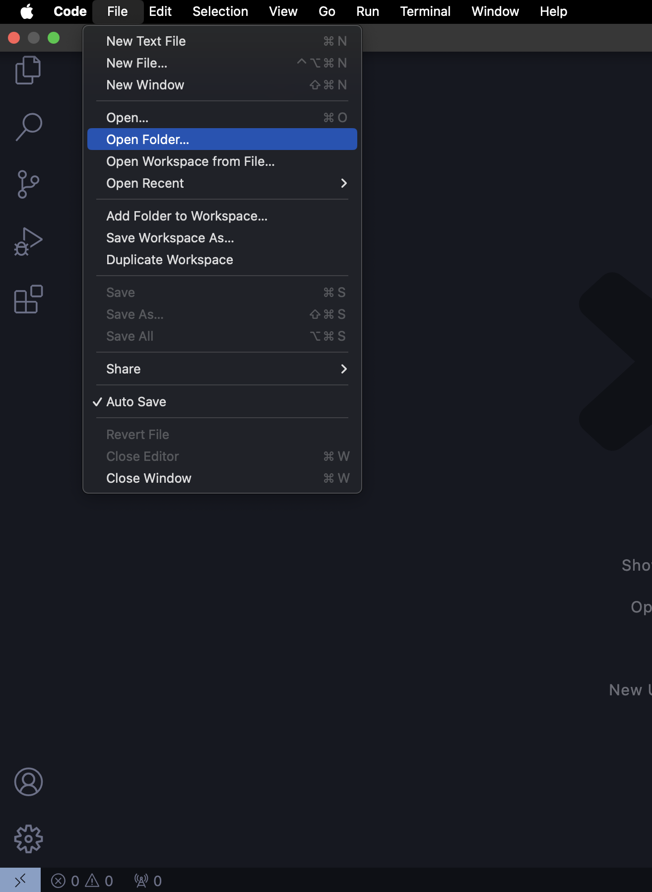
3. Click git icon on the left and click the button "Initialize Repository"
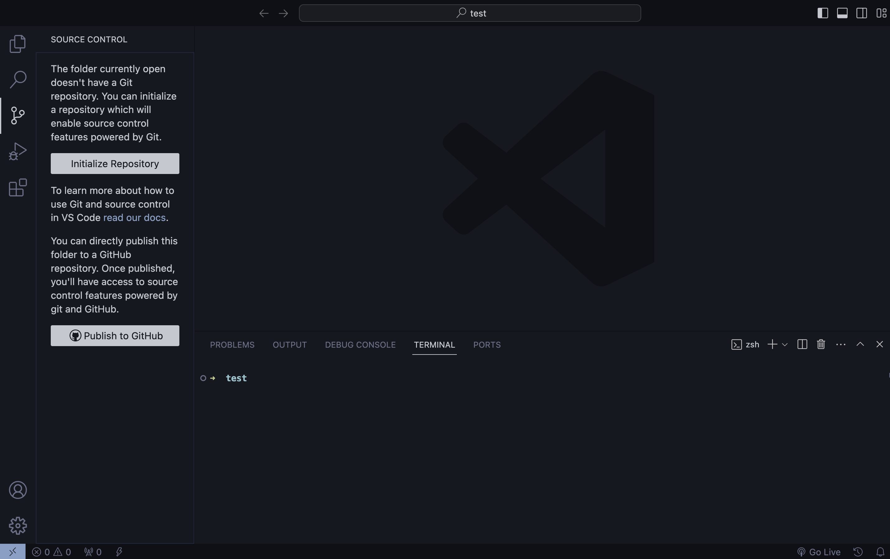
After creating any change in your directory, lets make a first [commit](https://www.atlassian.com/git/tutorials/saving-changes/git-commit).
4. Hover over your file name on the left and click of the **+** button appeared. This will [stage](https://githowto.com/staging_and_committing) your changes.
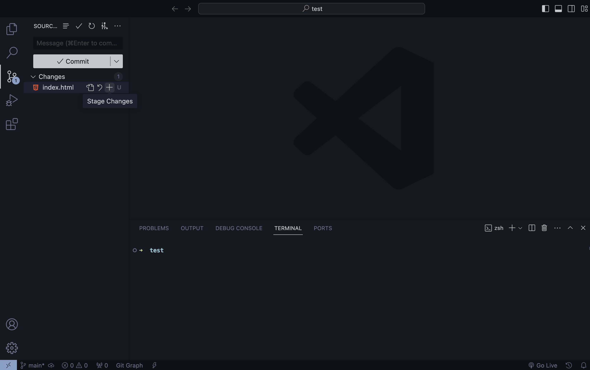
5. Enter your comments on the changes made (optional), and click on **Commit** button.
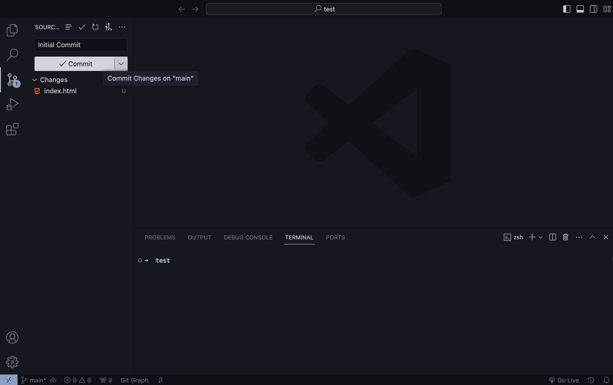

Your project folder is now initialized and your first commit has made!

---

### Create Remote Repository and Connect with Local

Next, let's create a remote repository and link it to your local repository:

1. Go to your preferred Git hosting service (e.g., GitHub, GitLab).
2. [Create a new repository](https://docs.github.com/en/get-started/getting-started-with-git/managing-remote-repositories) on the hosting service.
3. Copy the repository URL.
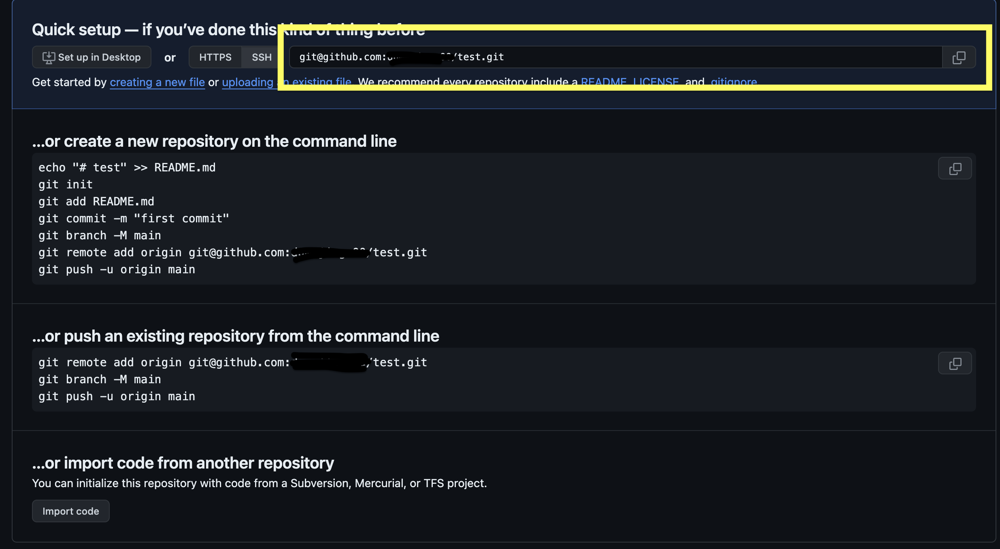
4. In VS Code, open the terminal.
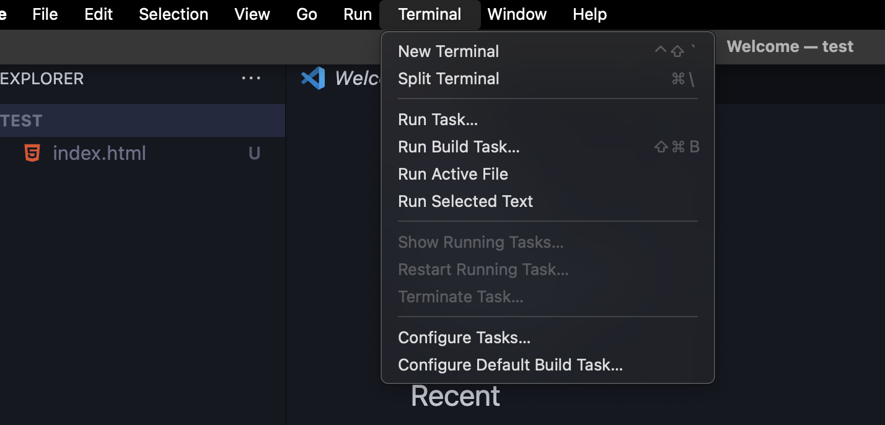
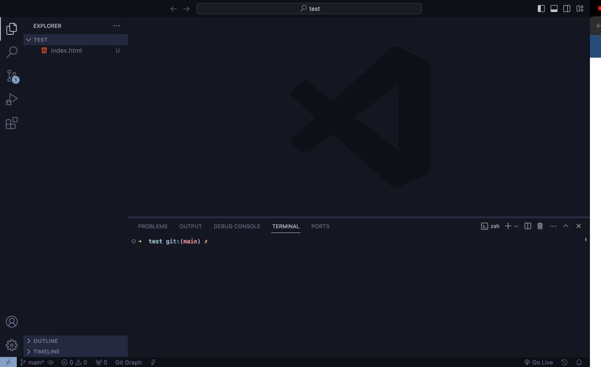
5. Type `git remote add origin <repository URL>` and press Enter.
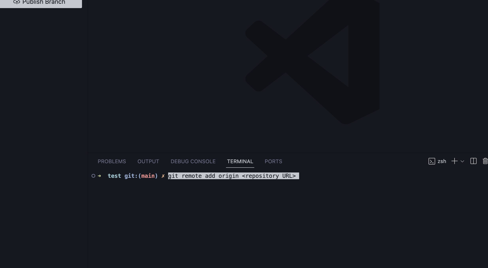

Your local repository is now connected to the remote repository.

---

### Push Changes

To push changes from your local repository to the remote repository:

1. In VS Code, open the terminal.

2. Push the changes to the remote repository.
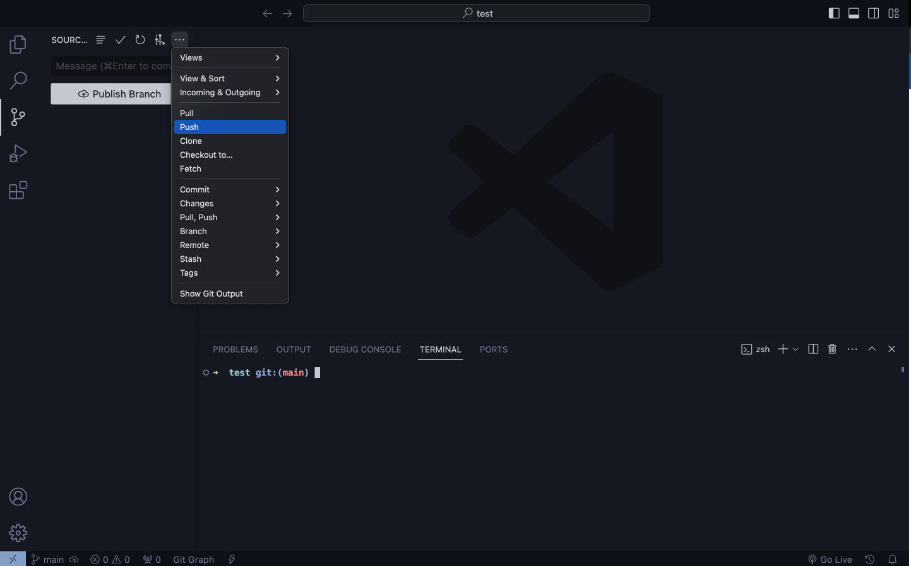
3. If you get this warning, press **Ok**.
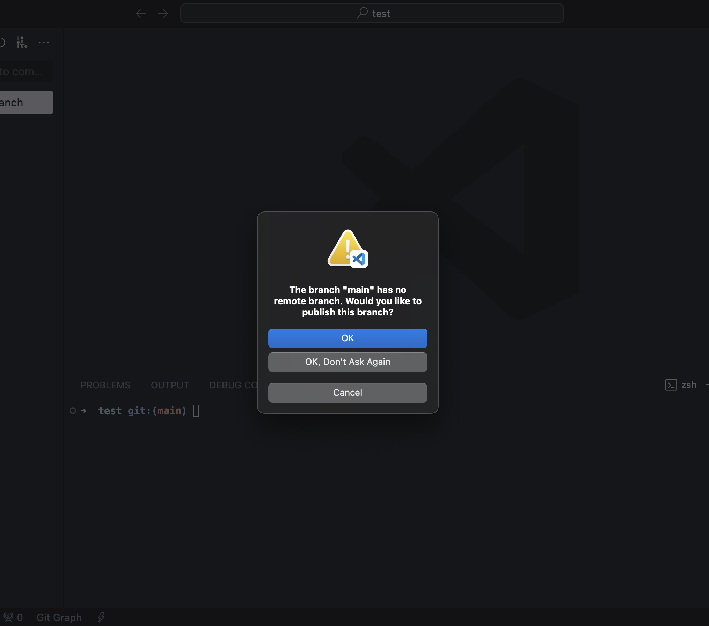
4. You can confirm (on your repository page) that you have successfully pushed your changes to the remote repository.
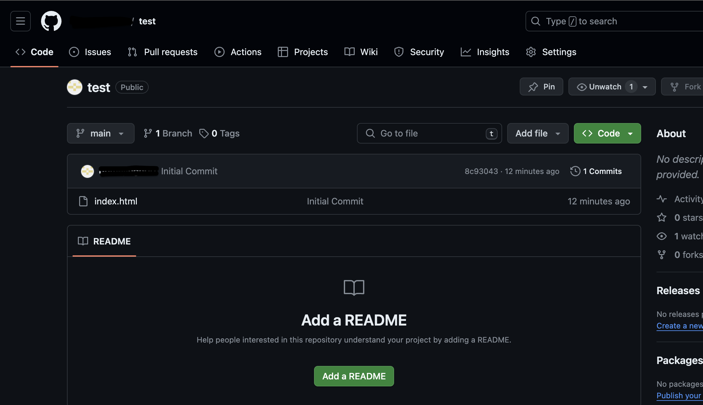

Your changes are now pushed to the remote repository.

## Useful Extensions

VS Code offers various extensions to enhance your Git workflow. Some useful extensions include:

- [**GitLens**](https://marketplace.visualstudio.com/items?itemName=eamodio.gitlens): Provides advanced Git capabilities such as blame annotations, repository/file history, and more.
- [**GitHub Pull Requests**](https://marketplace.visualstudio.com/items?itemName=GitHub.vscode-pull-request-github): Streamlines the process of creating, reviewing, and managing pull requests directly within VS Code.
- [**Git History**](https://marketplace.visualstudio.com/items?itemName=donjayamanne.githistory): Allows you to view and search through the history of your Git repositories.
- [**Git Graph**](https://marketplace.visualstudio.com/items?itemName=mhutchie.git-graph): Visualizes the history of branches and commits in your repository.

Install these extensions from the [VS Code Marketplace](https://marketplace.visualstudio.com/) to enhance your Git experience. For detailed explanation, please refer to [our page on VSCode extensions!](./Extension.md)

By following these steps and utilizing the recommended extensions, you can effectively manage your code repositories using Git within Visual Studio Code.

## Conclusion

Congratulations! You've learned how to effectively use Git within Visual Studio Code for managing your code repositories, collaborating with others using branching, and maximizing github functionality with extensions. Feel free to explore more advanced Git features and integrations to streamline your development workflow.

---
