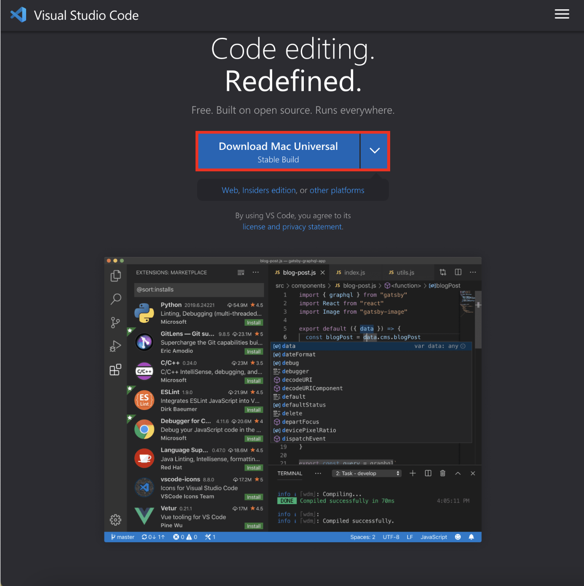
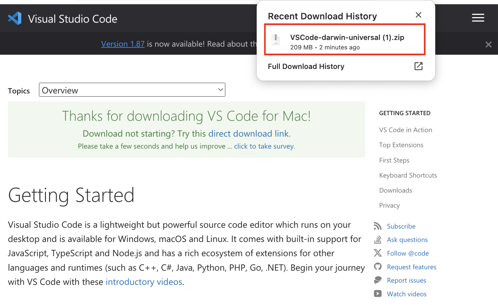
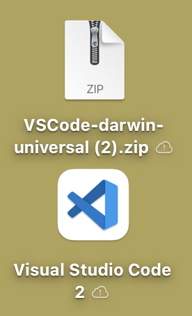

# Welcome to Instruction!

This guide provides an introduction and step-by-step instructions for installing essential tools to set up a web development environment. Node.js and npm are crucial for server-side development in JavaScript, Git is essential for collaboration and version control, and VSCode Extensions enhance development productivity.

# Before we start
VSCode is a lightweight yet powerful code editor that allows you to do the coding and download various node modules. Also, there is an extension that your life makes easier. To work on the next instructions, you need to install the VSCode and there are some steps to follow for installation.

## Installing Visual Studio Code
1. Visit the [Official VSCode Website](https://code.visualstudio.com/), you must see the download according to your OS.   

2. When you click the download button, it will brings you to Getting Started page, and automatically download the .zip file.   

3. Unzip the file, then it will automatically add an application on your background.

4. Now, you are good to go the next steps!
