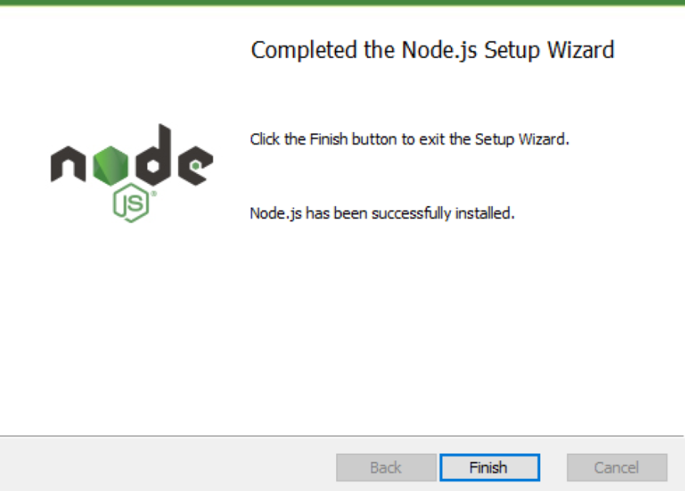

# Node.js Installation and Usage Guide

## Introduction to Node.js

Node.js is an asynchronous event-driven JavaScript runtime, ideal for developing scalable network applications. This guide will help you install Node.js and introduce its basic usage.

## Installing Node.js

The simplest way to install Node.js is by using the installer provided on the [Node.js official website](https://nodejs.org/).

### Windows Installation

1. Visit the [Node.js official website](https://nodejs.org/en) and navigate to the download section.
   

2. After downloading, execute the installer. When the installation file runs, click the 'Next' button.
   

3. Accept the terms in the License Agreement and click 'Next'.
   

4. Choose the directory where Node.js will be installed. The default path is C:\Program Files\nodejs\. Click 'Next'.
   

5. The following components will be installed:
    - Node.js runtime environment
    - Corepack manager: Core package manager (seldom used)
    - NPM package manager: Very frequently used and useful
    - Online documentation shortcuts: Not typically used
    - Add to PATH: Essential for command line usage
   
   Proceed by clicking 'Next', even if you do not plan to customize the components.
   
   

6. With the setup now complete, click the 'Install' button to proceed with the installation.
   

7. Once installation is finished, click 'Finish'.
   

### macOS Installation

1. Access the [Node.js official website](https://nodejs.org/en) and select the LTS version of Node.js.
   

2. Open the downloaded installer.
   

3. Proceed through the installer steps by clicking 'Continue'.
   

4. Agree to the license terms when prompted and click 'Agree'.
   

5. To begin the installation, click 'Install'.
  

