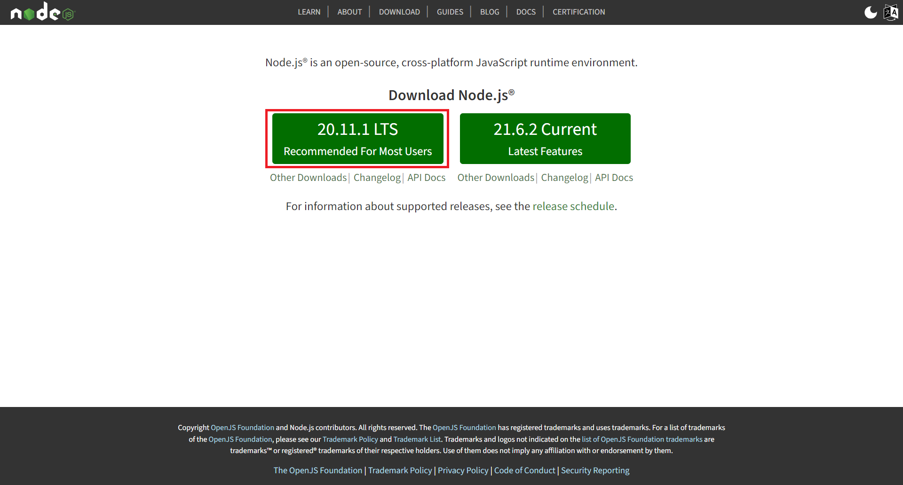
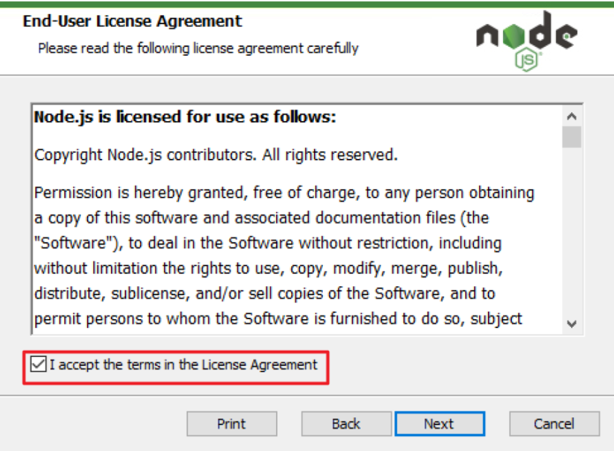
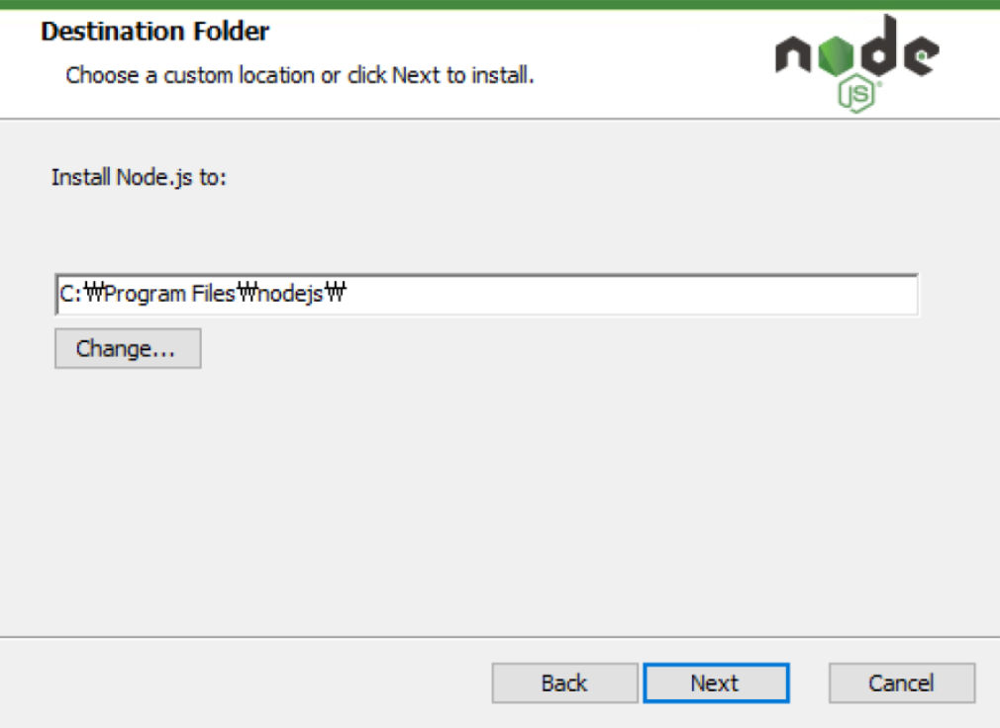
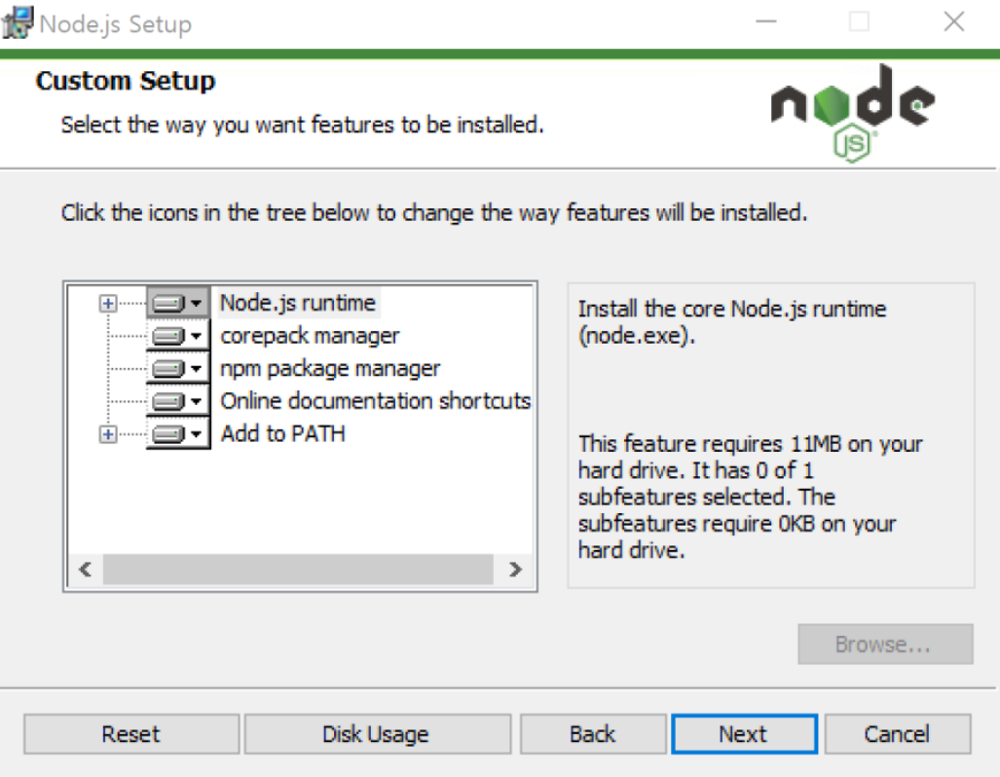
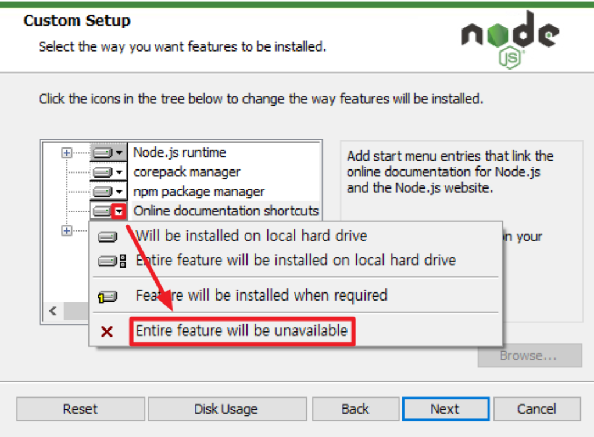
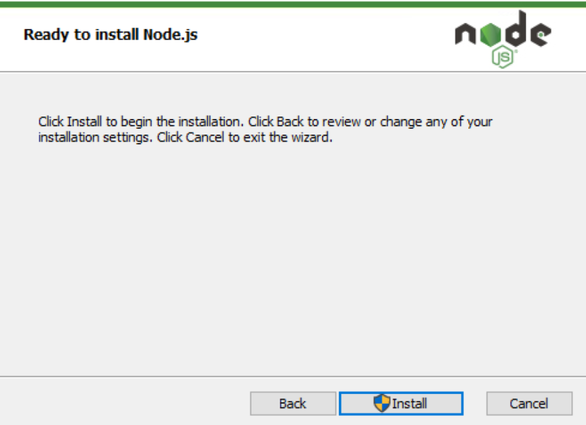
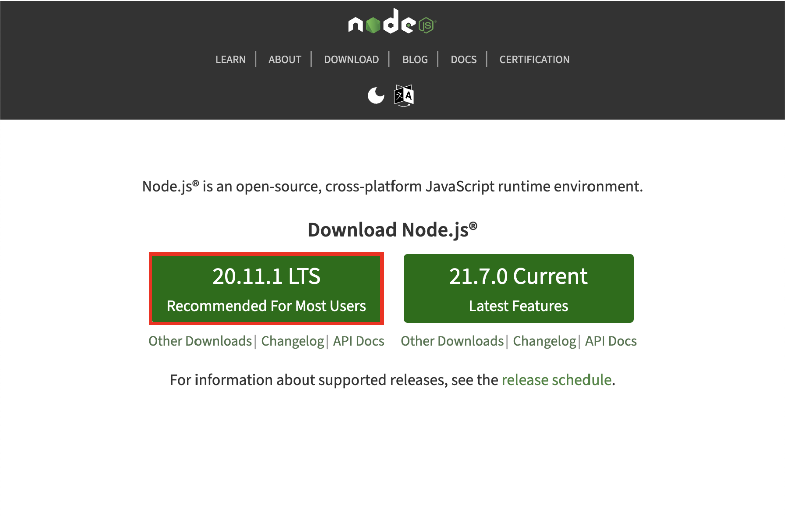
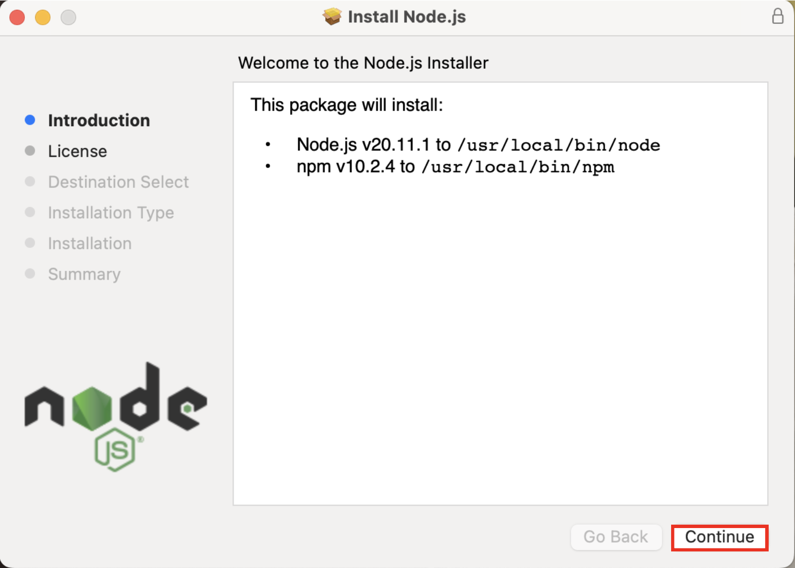
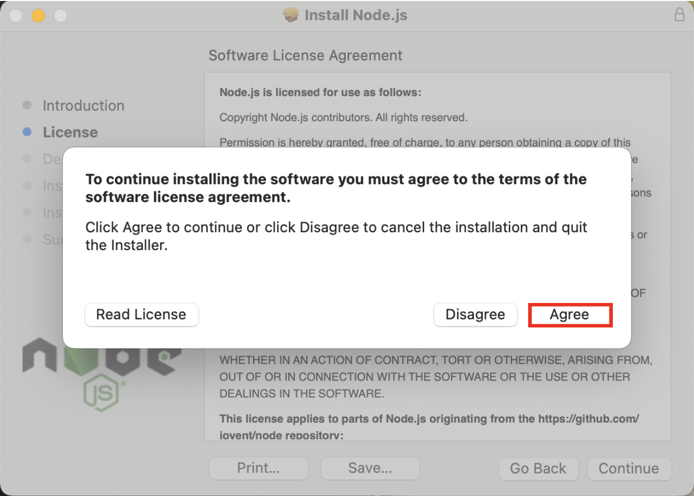

# Node.js Installation and Usage Guide

## Introduction to Node.js

Node.js is an asynchronous event-driven JavaScript runtime, ideal for developing scalable network applications. This guide will help you install Node.js and introduce its basic usage.

## Installing Node.js

The simplest way to install Node.js is by using the installer provided on the [Node.js official website](https://nodejs.org/).

### Windows Installation

1. Visit the [Node.js official website](https://nodejs.org/en) and navigate to the download section.
   

2. After downloading, execute the installer. When the installation file runs, click the 'Next' button.
   

3. Accept the terms in the License Agreement and click 'Next'.
   

4. Choose the directory where Node.js will be installed. The default path is C:\Program Files\nodejs\. Click 'Next'.
   

5. The following components will be installed:
    - Node.js runtime environment
    - Corepack manager: Core package manager (seldom used)
    - NPM package manager: Very frequently used and useful
    - Online documentation shortcuts: Not typically used
    - Add to PATH: Essential for command line usage
   
   Proceed by clicking 'Next', even if you do not plan to customize the components.
   
   

6. With the setup now complete, click the 'Install' button to proceed with the installation.
   

7. Once installation is finished, click 'Finish'.
   

### macOS Installation

1. Access the [Node.js official website](https://nodejs.org/en) and select the LTS version of Node.js.
   

2. Open the downloaded installer.
   

3. Proceed through the installer steps by clicking 'Continue'.
   

4. Agree to the license terms when prompted and click 'Agree'.
   

5. To begin the installation, click 'Install'.
  

# Troubleshooting Guide: Node.js Installation and Usage

## Introduction

This troubleshooting guide provides solutions to common issues that users may encounter while installing and using Node.js on Windows and macOS.

### Common Installation Issues and Solutions

1. **Download Failure**
   - **Issue:** Unable to download the Node.js installer from the official website.
   - **Solution:** Check your internet connection and ensure that you're accessing the correct URL (https://nodejs.org/). If the issue persists, try downloading from a different network or using a different browser.

2. **Installer Execution Error (Windows)**
   - **Issue:** Error encountered while executing the Node.js installer on Windows.
   - **Solution:** Verify that the downloaded installer file is not corrupted. Try running the installer with administrative privileges by right-clicking on the file and selecting "Run as administrator."

3. **Installer Execution Error (macOS)**
   - **Issue:** Unable to execute the Node.js installer on macOS.
   - **Solution:** Ensure that your macOS version is compatible with the Node.js installer. Check for any system updates and try disabling antivirus software temporarily during the installation process.

4. **Component Selection Error (Windows)**
   - **Issue:** Unable to select or customize components during the Node.js installation on Windows.
   - **Solution:** If you encounter errors during component selection, try installing Node.js with the default settings. These settings include the Node.js runtime environment, NPM package manager, and other essential components.

5. **PATH Configuration Error (Windows)**
   - **Issue:** Node.js executable not added to the system PATH on Windows.
   - **Solution:** Manually add the Node.js directory to the system PATH if it was not automatically added during installation. You can do this by accessing the system environment variables and adding the Node.js directory path.

6. **License Agreement Error (macOS)**
   - **Issue:** Unable to proceed with the Node.js installation on macOS due to license agreement acceptance.
   - **Solution:** Ensure that you're able to view and accept the license agreement prompt during installation. If the prompt does not appear, try reinstalling Node.js after restarting your macOS system.

### Usage Issues and Solutions

1. **Node.js Command Not Found**
   - **Issue:** Node.js command not recognized in the terminal after installation.
   - **Solution:** Verify that Node.js was installed successfully by running `node -v` in the terminal. If the command is not recognized, try restarting the terminal or reinstalling Node.js.

2. **npm Installation Error**
   - **Issue:** Error encountered while installing npm (Node Package Manager).
   - **Solution:** Ensure that npm is installed along with Node.js by checking the installation logs or running `npm -v` in the terminal. If npm is missing, reinstall Node.js or install np

