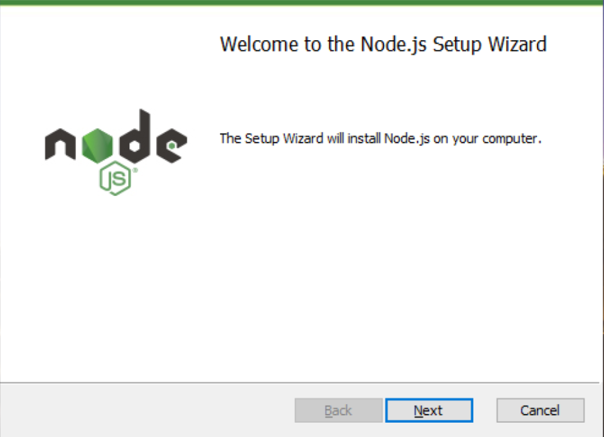

# Node.js User Guide

## 1. What is Node.js?

Node.js is a JavaScript runtime built on Chrome's V8 JavaScript engine. It enables running JavaScript outside web browsers, primarily for server-side development.

### Chrome's V8 Engine

- Originally, JavaScript was confined to web browser execution.
- Each web browser has its JavaScript engine, with Chrome's V8 engine being notable for its speed.
- Node.js extends the V8 engine's capabilities, allowing JavaScript execution in server environments.

### JavaScript Runtime

- The term 'runtime' denotes the environment in which a program executes.
- Node.js provides a standalone environment for JavaScript code execution, facilitating its use in back-end applications.

## 2. Advantages of Node.js

1. **Language Unification**: Utilizing a single language for both client-side and server-side streamlines learning and enhances productivity.
2. **Community**: Node.js boasts a robust and supportive developer community, offering a wealth of resources and support.
3. **Module Ecosystem**: The npm (Node Package Manager) houses a vast array of third-party modules, aiding in rapid development and deployment.

## 3. Conclusion

Node.js harnesses the efficient V8 engine and a rich module ecosystem, providing a versatile environment for full-stack JavaScript development. Its integrated approach facilitates a streamlined and productive development experience.

# Node.js Installation Guide

## Installing Node.js on Windows

1. Navigate to the [Node.js official website](https://nodejs.org/en) and download the installer for Windows.

    

2. Run the downloaded installer. When the installation wizard opens, click 'Next'.

    

3. Accept the license agreement and click 'Next'.

    

4. Choose the installation directory (default is C:\Program Files\nodejs) and click 'Next'.

    

5. Select the components you wish to install. It is typically recommended to leave these at their default settings. Click 'Next' to continue.

    

6. Review your selections and click 'Install' to proceed with the installation.

    

7. Once the installation is complete, click 'Finish' to close the installer.

    

## Installing Node.js on macOS

1. Visit the [Node.js official website](https://nodejs.org/en) and download the macOS installer.

    

2. Open the downloaded .pkg file to start the installation process.

    

3. Follow the installation steps in the wizard, clicking 'Continue' to proceed through each step.

    

4. Agree to the software license agreement to continue with the installation.

    

5. Click 'Install' to begin the installation process. You may need to provide your administrator password.

After completing these steps, Node.js will be installed on your system. You can verify the installation by opening a terminal or command prompt and typing `node -v`, which should display the current version of Node.js installed on your system.

## Verifying Node.js Installation

Follow the steps below to verify that Node.js has been properly installed.

### Verifying Node.js Installation on Windows

1. Type 'cmd' or 'Terminal' in the search bar on the taskbar and press [Enter] to open the Command Prompt.
2. In the Command Prompt window, type `node` and press [Enter].
3. If the installed version of Node.js appears and the cursor changes to `>`, it indicates that Node.js is successfully installed.
4. You can now execute JavaScript code. For example, typing `console.log(1 + 2)` and pressing [Enter] should output 3.
5. To exit the Node.js environment, press [Ctrl+C] twice, then close the Command Prompt window.

### Verifying Node.js Installation on macOS

1. Click on the 'Terminal' icon in the Dock or Launchpad to open the Terminal app.
2. In the Terminal window, type `node` and press [Enter].
3. If Node.js version information is displayed and the cursor changes to `>`, Node.js is installed correctly.
4. Test executing JavaScript code, such as `console.log(1 + 2)`. If it outputs 3, your setup is correct.
5. To exit the Node.js environment, press [Ctrl+C] twice and close the Terminal.

By following these steps, you can confirm whether Node.js has been successfully installed on your system. Once verified, you can execute various JavaScript codes in the Node.js environment.

# Writing and Running a Simple Node.js Code

After installing Node.js and setting up the development environment in Visual Studio Code (VS Code), you're ready to write and execute some simple Node.js code. Unlike front-end development, where you link JavaScript files to HTML documents or insert code directly into HTML and view the output in a web browser, with Node.js, you can execute the code directly and see the results immediately.

## Executing a Simple Node.js Code

1. **Opening VS Code and Editing a JavaScript File**

   Launch VS Code and open the `hello.js` file located in the `01` folder. Initially, this file will be empty. Enter the following code and save the file:

```javascript
const hello = (name) => {
console.log("Hello, " + name);
};

hello("Jane");
```


Here, we declare a function named hello that takes a name parameter and prints a greeting to the console. We then call this hello function with "Jane" as the argument.

1. Opening the Terminal

To open the terminal window within VS Code, use the \[Ctrl + Shift + \` \] shortcut (for Mac users, it's \[Command + Shift + \` \]).

The terminal displays the current working folder path. To execute a JavaScript file in Node.js, you need to be in the directory containing the file. To run the hello.js file in the 01 folder, you must navigate to this folder first. Type the following command in the terminal to change directories:

2. Executing JavaScript with Node.js

In Node.js, you execute a JavaScript file using the node command followed by the filename. You can omit the .js extension, as most developers do:

```bash
node hello
```

This command executes the hello function within the hello.js file, and the result is displayed in the terminal.

3. Verifying the Execution Result

The output of the hello function execution is displayed in the terminal. In this example, you would see:

```
hello, Jane
```

Using Node.js allows you to run JavaScript code outside a web browser and view the results immediately in your development environment.


# Congratulations!
You have now installed Node.js and learned how to write and run a basic Node.js program. With this knowledge, you can lay the foundation for server-side development using Node.js.
