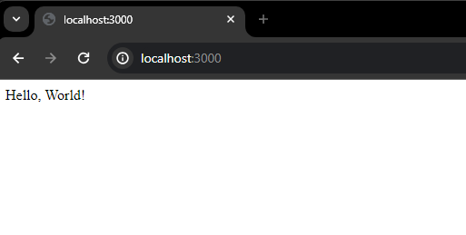

# A Guide to Setting Up Node.js Projects with npm

## Introduction to npm

Setting up Node.js projects with npm (Node Package Manager) in Visual Studio Code (VSC) is a fundamental process for many developers. Below is a comprehensive step-by-step guide to help you set up your Node.js project in VSC using npm:

## Prerequisites:

Make sure you have Visual Studio Code and Node.js installed on your system. You can download and install them by following these guides: [Install Visual Studio Code](https://jin-fswd.github.io/COMM_mkdocs/) and [Install Node.js](https://jin-fswd.github.io/COMM_mkdocs/node/).

## Steps: 
1. **Create a New Folder for Your Project:**
Open Visual Studio Code and create a new folder where you want to set up your Node.js project. You can do this by navigating to 
`File > Open Folder...` and then selecting or creating a new folder.
2. **Open Terminal in Visual Studio Code:**
Once you have your project folder open in Visual Studio Code, you need to open an integrated terminal. You can do this by navigating to `View > Terminal`.
3. **Change Project Directory:**
In the terminal, navigate to your project directory if you're not already there, using the cd command: 

```bash
cd path/to/your/project
```
4. **Initialize Your Project with npm:**
Now, initialize your project with npm by running the following command in the Terminal (This command will create a `package.json` file with default values in your project directory):

```bash
npm init -y
```

5. **Install Dependencies:**
You can start installing dependencies for your project using npm. For example, let's install Express.js, a popular Node.js framework. Type the following command in the Terminal:

```bash
npm install express
```

6. **Install Dependencies (Multiple):**
To install multiple dependencies for your project using npm, you can list them all in a single command. For example, let's install Express.js and Body-parser, both popular Node.js packages. Type the following command in the Terminal:

```bash
npm install express body-parser
```

7. **Create Your Node.js Application:**
Now, you can start writing your Node.js application code. Create a new JavaScript file (e.g., app.js) in your project directory and start writing your Node.js code. Let's look at a very simple code:

```javascript
// app.js
const express = require('express');
const app = express();

app.get('/', (req, res) => {
  res.send('Hello, World!');
});

app.listen(3000, () => {
  console.log('Server is running on http://localhost:3000');
});
```

6. **Run Your Node.js Application:**
To run your Node.js application, you can use the integrated terminal in Visual Studio Code. Make sure you're in your project directory, and then type the following command in the Terminal:

```bash
node app.js
```

7. **View in Web Browser:**
Now that the Node.js server is live, you can access it by visiting `http://localhost:3000` in your web browser. Simply copy and paste the URL into the address bar at the top of the browser. 




8. Congratulations! You have successfully set up a Node.js project using npm in Visual Studio Code. 